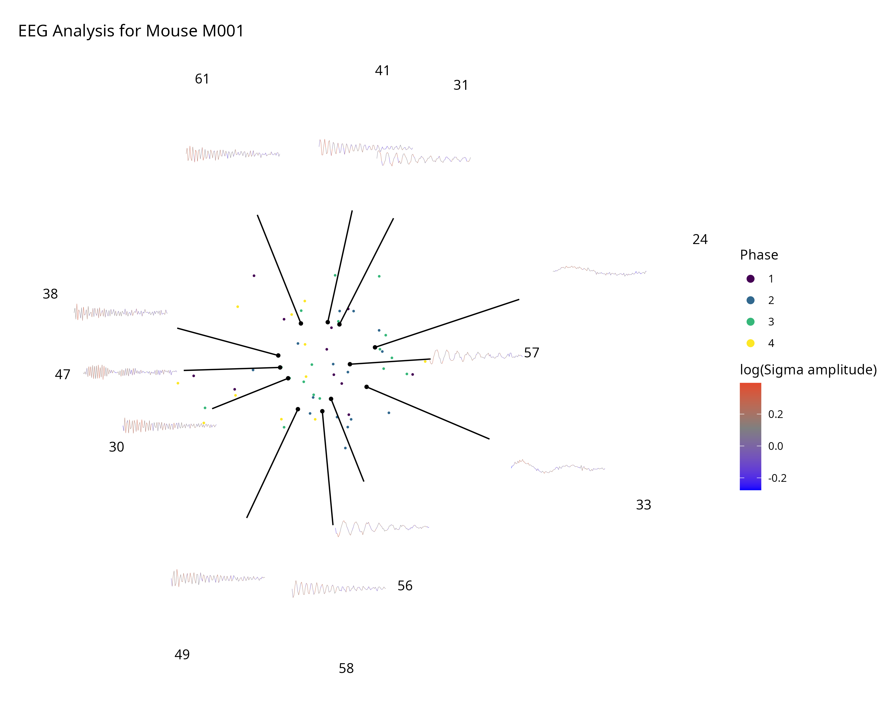
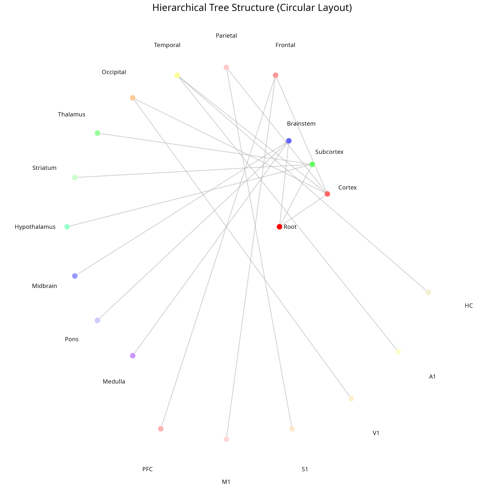

# 📊 R/ggplot2 Plot Catalogue

*A comprehensive catalog of R/ggplot2 visualization functions with examples and documentation.*

---

## 🎯 Overview

This repository contains a curated collection of R/ggplot2-based plotting functions extracted from research codebases. Each function is documented with:

- 🖼 **Visual preview** (PNG output)
- 📦 **Expected data format** 
- 🧠 **Complexity level** (beginner/intermediate/advanced)
- 🧪 **Code examples** with mock data
- 🗂 **Tags** for easy discovery

---

## 📁 Repository Structure

```
├── code_repository/          # Original R files with functions
├── code/                     # Individual plot scripts  
├── figure/                   # Generated PNG plots
└── README.md                 # This catalog
```

---

## 🔧 Environment Setup

**R Environment**: Uses conda environment `r-env` with R 4.4.3

```bash
# Activate R environment
source /home/iharuto/miniconda3/etc/profile.d/conda.sh
conda activate r-env

# Run scripts
Rscript code/{difficulty}_{id}.R
```

**Required packages**: `ggplot2`, `dplyr`, `tidyverse`, `viridis`

---

## 📖 Plot Catalog

### Advanced Level Functions

<details>
<summary><strong>🔍 Click to expand Advanced plots (2 functions)</strong></summary>

#### 📊 `SankeyArrow()` — Advanced

**File**: [`code/advanced_1.R`](code/advanced_1.R) | **Preview**:   
**Original**: `code_repository/figure_function_Brain_Blast.R:3`  
**Plot Type**: Flow Diagram / Sankey  
**Tags**: `flow`, `sankey`, `custom_geometry`, `segments`, `publication`

##### 📦 Expected Data Format

```r
# Function parameters:
values = c(1000, 300, 250, 200, 150, 100)  # Flow values (input + outputs)
label = c("Input", "Process A", "Process B", "Process C", "Process D", "Output")
gap = 0.05           # Gap between segments
size = 4             # Text size
force = FALSE        # Force plot even if inputs != outputs
trans_log = FALSE    # Apply log transformation
```

##### 🧠 Complexity Assessment: **Advanced**
- **Geometric calculations**: Complex positioning algorithms for proportional flows
- **Multiple geom layers**: 15+ `geom_segment()` calls with dynamic coordinates  
- **Custom layout logic**: Iterative flow positioning with mathematical transformations
- **Error handling**: Input validation and flow conservation checks

##### 🧪 Key Code Components

```r
# Core flow visualization logic
for (i in length(op) : 1) {
  # Calculate proportional positions
  line1 <- data.frame(x = -0.4, y = 0, xend = x_inits[i], yend = 0)
  # Dynamic segment creation with curves and arrows
  geom_curve(aes(x = x, y = y, xend = xend, yend = yend), curvature = 0.5)
}
coord_fixed(ratio = 1) + theme_void()
```

---

#### 🧠 `plot_PCA_raw_EEG_mouse()` — Advanced

**File**: [`code/advanced_2.R`](code/advanced_2.R) | **Preview**:   
**Original**: `code_repository/figure_function_EEG_analysis.R:38`  
**Plot Type**: Multi-layer Scatter + Time Series  
**Tags**: `PCA`, `EEG`, `neuroscience`, `time_series`, `multi_layer`, `scatter`

##### 📦 Expected Data Format

```r
# Main dataset:
data.frame(
  data.ID = character(),     # Subject/mouse identifier
  latent1 = numeric(),       # First PCA component
  latent2 = numeric(),       # Second PCA component  
  epoch = numeric(),         # Time epoch number
  cluster.4 = factor()       # Phase/cluster assignment
)

# Function parameters:
mouse_id = "M001"      # Mouse to visualize
distance = 1           # Scaling factor for coordinates
```

##### 🧠 Complexity Assessment: **Advanced**
- **Multi-layer composition**: 6+ different geom types (points, segments, paths, text)
- **Coordinate transformations**: Complex mathematical mapping between latent and display space
- **Dynamic color scaling**: Gradient calculations with custom midpoint and range adjustment
- **Data integration**: Combines scatter plot with time series traces in unified coordinate system

##### 🧪 Key Code Components

```r
# Multi-layer visualization with coordinate transformation
ggplot(mapping = aes(latent1, latent2)) +
  geom_point(aes(fill = cluster.4), shape = 21, size = 1) +
  geom_segment(aes(xend = 2.5 * sqrt(2) / distance * latent1, 
                   yend = 2.5 * sqrt(2) / distance * latent2)) +
  geom_path(aes(x, y, group = Epochs, color = log_Sigma), linewidth = 0.1) +
  scale_color_gradient2(high = "red", low = "blue", mid = "gray50") +
  theme_void()
```

</details>

### Intermediate Level Functions

<details>
<summary><strong>🔍 Click to expand Intermediate plots (1 function)</strong></summary>

#### 🌳 `make_template_tree()` — Intermediate

**File**: [`code/intermediate_1.R`](code/intermediate_1.R) | **Preview**:   
**Original**: `code_repository/figure_function_IUNCTIO.R:1`  
**Plot Type**: Circular Tree Network  
**Tags**: `network`, `tree`, `circular`, `hierarchical`, `brain_atlas`, `nodes_edges`

##### 📦 Expected Data Format

```r
data.frame(
  id = numeric(),                    # Unique node identifier
  name = character(),                # Node label/name
  parent_structure_id = numeric(),   # Parent node ID (NA for root)
  color_hex_triplet = character(),   # Hex color without '#'
  depth = numeric()                  # Hierarchical level (0=root, 1=level1, etc.)
)
```

##### 🧠 Complexity Assessment: **Intermediate**
- **Graph data structures**: Parent-child relationship handling with joins
- **Circular positioning**: Trigonometric calculations for node placement
- **Multiple geom coordination**: Points, segments, and text with custom positioning
- **Color customization**: Dynamic color assignment from hex codes

##### 🧪 Key Code Components

```r
# Circular layout with hierarchical positioning
positions <- df %>%
  mutate(
    angle = seq(0, 2*pi, length.out = n_nodes + 1)[1:n_nodes],
    radius = depth + 1,
    x = radius * cos(angle),
    y = radius * sin(angle)
  )

# Network visualization
ggplot() +
  geom_segment(aes(x = parent_x, y = parent_y, xend = child_x, yend = child_y)) +
  geom_point(aes(x = x, y = y, color = I(color)), size = 3) +
  coord_fixed()
```

</details>

---

## 📊 Summary Statistics

| Complexity Level | Functions | Plot Types |
|------------------|-----------|------------|
| **Advanced** | 2 | Flow diagrams, Multi-layer scientific plots |
| **Intermediate** | 1 | Network/Tree visualizations |
| **Beginner** | 0 | *(To be added)* |

### Plot Type Distribution
- **Flow/Network diagrams**: 2 functions
- **Scientific visualization**: 1 function  
- **Multi-layer plots**: 2 functions

---

## 🚀 Quick Start

1. **Setup environment**:
   ```bash
   conda activate r-env
   ```

2. **Run example**:
   ```bash
   Rscript code/advanced_1.R
   ```

3. **View output**:
   ```bash
   open figure/advanced_1.png
   ```

---

## 🤝 Contributing

To add new plotting functions:

1. Create R script: `code/{difficulty}_{next_id}.R`
2. Generate PNG: `figure/{difficulty}_{next_id}.png`  
3. Update this README with documentation
4. Follow the established format for consistency

---

## 📝 Notes

- All plots use mock/synthetic data for demonstration
- Original functions may require additional dependencies
- PNG files generated at 300 DPI for publication quality
- Code examples simplified for clarity while preserving core functionality

*Generated with Claude Code - Last updated: 2025-06-15*